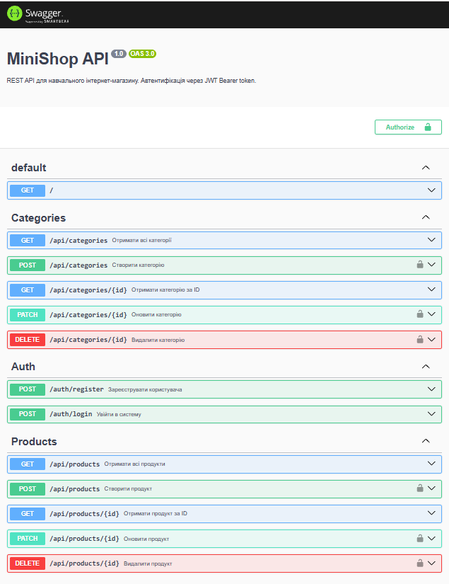

# Практичні роботи

## Навігація

- [Практичне заняття 1: Підготовка середовища для розробки](#практичне-заняття-1-підготовка-середовища-для-розробки)
- [Практичне заняття 2: NestJS + PostgreSQL + Redis у Docker](#практичне-заняття-2-nestjs--postgresql--redis-у-docker)
- [Практичне заняття 3: MiniShop CRUD REST API на NestJS](#практичне-заняття-3-minishop-crud-rest-api-на-nestjs)
- [Практичне заняття 4: DTO + class-validator + Pipes](#практичне-заняття-4-dto--class-validator--pipes)
- [Практичне заняття 5: JWT Authentication + Guards + RBAC](#практичне-заняття-5-jwt-authentication--guards--rbac)
- [Практичне заняття №6: Interceptors + Exception Filters + Swagger](#практичне-заняття-6--interceptors--exception-filters--swagger)
- [Практичне заняття №7: Redis кешування + Query параметри + Pagination](#практичне-заняття-7--redis-кешування--query-параметри--pagination)
- [Практичне заняття №8: Модуль замовлень — фінальний проєкт MiniShop](#практичне-заняття-8-модуль-замовлень--фінальний-проєкт-minishop)
  
---

# Практичне заняття 1: Підготовка середовища для розробки

## Student

* Name: Лук'янова Ю. А.
* Group: 232.1

## Опис роботи

У межах практичного заняття було підготовлено базове середовище для подальшої розробки.
Було встановлено та перевірено Docker Desktop, Docker Compose і Git. Також було створено GitHub-репозиторій, додано базовий `Dockerfile` і `docker-compose.yml` для запуску контейнера з актуальною версією npm.

## Перевірка Docker, Docker Compose та Git

Команди:

```bash
docker --version
docker compose version
git --version
```

Вивід:

```text
Docker version 29.5.3, build d1c06ef
Docker Compose version v5.1.4
git version 2.54.0.windows.1
```

## Перевірка роботи Docker

Команда:

```bash
docker run --rm hello-world
```

Вивід:

```text
Hello from Docker!

This message shows that your installation appears to be working correctly.
```

## Перевірка docker-compose та latest npm

Команда:

```bash
docker compose up --build
```

Вивід:

```text
Image hlpf-env-setup-npm Built
Network hlpf-env-setup_default Created
Container hlpf-env-setup-npm-1 Created
npm-1 | 11.17.0
npm-1 exited with code 0
```

## Перевірка версії npm

Команда:

```bash
docker compose run --rm npm npm -v
```

Вивід:

```text
11.17.0
```

## Перевірка версії Node.js

Команда:

```bash
docker compose run --rm npm node --version
```

Вивід:

```text
v26.3.1
```

## Структура репозиторію

```text
.
├── Dockerfile
├── docker-compose.yml
└── README.md
```

## Висновок

У результаті виконання практичного заняття було підготовлено базове середовище для розробки.
Docker Desktop і Docker Compose успішно встановлено та перевірено. Команда `hello-world` підтвердила коректну роботу Docker. Також було створено GitHub-репозиторій, додано `Dockerfile` і `docker-compose.yml`, після чого через Docker Compose було перевірено версії npm та Node.js.


---

# Практичне заняття 2: NestJS + PostgreSQL + Redis у Docker

## Student

* Name: Лук'янова Ю. А.
* Group: 232.1

## Опис роботи

У межах практичного заняття було розширено середовище з Практичної роботи №1.
До проєкту додано NestJS-застосунок, базу даних PostgreSQL та Redis для кешування.
Усі сервіси запускаються через Docker Compose.

## Структура репозиторію

```text
.
├── src/
│   ├── main.ts
│   ├── app.module.ts
│   ├── app.controller.ts
│   └── app.service.ts
├── Dockerfile
├── docker-compose.yml
├── .env.example
├── package.json
├── tsconfig.json
├── nest-cli.json
└── README.md
```

## Запуск проєкту

```bash
cp .env.example .env
docker compose up --build
```

Файл `.env.example` містить приклади змінних оточення для навчального запуску проєкту.

## Перевірка сервісів

Команда:

```bash
docker compose ps
```

Вивід:

```text
NAME                         IMAGE                  STATUS
hlpf-env-setup-app-1          hlpf-env-setup-app     running
hlpf-env-setup-postgres-1     postgres:16-alpine     running (healthy)
hlpf-env-setup-redis-1        redis:7-alpine         running (healthy)
```

## Перевірка PostgreSQL

Команда:

```bash
docker compose exec postgres psql -U nestuser -d nestdb -c '\l'
```

Вивід:

```text
List of databases
Name      | Owner    | Encoding
----------+----------+---------
nestdb    | nestuser | UTF8
postgres  | nestuser | UTF8
template0 | nestuser | UTF8
template1 | nestuser | UTF8
```

## Перевірка Redis

Команда:

```bash
docker compose exec redis redis-cli ping
```

Вивід:

```text
PONG
```

## Перевірка застосунку

Команда:

```bash
curl http://localhost:3000
```

Вивід:

```text
Hello World!
```

Також застосунок можна перевірити у браузері за адресою:

```text
http://localhost:3000
```

Очікувана відповідь:

```text
Hello World!
```

## Логи NestJS

Команда:

```bash
docker compose logs app
```

Фрагмент логів:

```text
[Nest] LOG [NestFactory] Starting Nest application...
[Nest] LOG [InstanceLoader] TypeOrmModule dependencies initialized
[Nest] LOG [InstanceLoader] CacheModule dependencies initialized
[Nest] LOG [NestApplication] Nest application successfully started
```

## Підключення PostgreSQL через TypeORM

У файлі `src/app.module.ts` додано `TypeOrmModule.forRoot(...)`.

Підключення використовує змінні оточення:

```text
POSTGRES_HOST
POSTGRES_PORT
POSTGRES_USER
POSTGRES_PASSWORD
POSTGRES_DB
```

## Підключення Redis через CacheModule

У файлі `src/app.module.ts` додано `CacheModule.registerAsync(...)`.

Підключення використовує змінні оточення:

```text
REDIS_HOST
REDIS_PORT
```

## Коміти

У репозиторії створено нові коміти:

```text
add postgresql and redis to docker-compose
init nestjs project with db and redis connection
```

## Висновок

У результаті виконання практичного заняття було створено Docker-середовище для NestJS-застосунку з підключенням PostgreSQL та Redis.
Було налаштовано `Dockerfile`, `docker-compose.yml`, змінні оточення, структуру NestJS-проєкту, підключення до бази даних через TypeORM та кешування через Redis.


---

# Практичне заняття 3: MiniShop CRUD REST API на NestJS

## Student

- Name: Лук'янова Ю. А.
- Group: 232.1

## Опис роботи

У межах практичного заняття було розширено NestJS-проєкт MiniShop. Реалізовано REST API для керування категоріями та товарами з використанням PostgreSQL, TypeORM, Redis і Docker Compose.

Було створено дві сутності: `Category` та `Product`. Між товаром і категорією реалізовано зв'язок Many-to-One: один товар може належати одній категорії, а категорія може містити багато товарів.

## Міграції бази даних

Для роботи зі схемою бази даних вимкнено автоматичну синхронізацію:

```ts
synchronize: false
```

Створено та виконано дві міграції:

| Тип | Файл | Призначення |
|---|---|---|
| Ручна | `1700000001000-CreateTables.ts` | Створює таблиці `categories` і `products` |
| Згенерована | `1781921208651-AddIsActiveToProducts.ts` | Додає поле `isActive` до таблиці `products` |

Міграції підключено до `app.module.ts` і вони запускаються автоматично через `migrationsRun: true`.

## Реалізовані модулі

### CategoriesModule

Реалізовано CRUD-операції для категорій:

| Метод | URL | Опис |
|---|---|---|
| POST | `/categories` | Створення категорії |
| GET | `/categories` | Отримання всіх категорій |
| GET | `/categories/:id` | Отримання категорії за id |
| PATCH | `/categories/:id` | Оновлення категорії |
| DELETE | `/categories/:id` | Видалення категорії |

### ProductsModule

Реалізовано CRUD-операції для товарів:

| Метод | URL | Опис |
|---|---|---|
| POST | `/products` | Створення товару |
| GET | `/products` | Отримання всіх товарів |
| GET | `/products/:id` | Отримання товару за id |
| PATCH | `/products/:id` | Оновлення товару |
| DELETE | `/products/:id` | Видалення товару |

Під час створення товару можна передати `categoryId` для встановлення зв'язку з категорією.

## Перевірка роботи

Під час перевірки успішно виконано:

- створення категорії `Electronics`;
- створення товару `Wireless headphones` із прив'язкою до категорії;
- отримання списку товарів;
- оновлення значень `stock` та `isActive`;
- видалення товару;
- видалення категорії;
- збірку проєкту командою `docker compose run --rm app npm run build`;
- чистий запуск після видалення Docker volume командою `docker compose up --build -d`.

Проєкт доступний за адресою:

```text
http://localhost:3000
```

## Висновок

У результаті роботи створено MiniShop CRUD REST API з двома пов'язаними сутностями, ручною та згенерованою міграціями, вимкненою автоматичною синхронізацією бази даних і можливістю запуску проєкту з нуля через Docker Compose.


---

# Практичне заняття 4: DTO + class-validator + Pipes

## Student

- Name: Лук'янова Ю. А.
- Group: 232.1

## Опис роботи

У межах практичного заняття до MiniShop API було додано валідацію вхідних даних. Створено окремі DTO-класи для категорій і товарів з декораторами `class-validator`, підключено глобальний `ValidationPipe`, а контролери й сервіси переведено на строго типізовані DTO.

Також створено кастомний `TrimPipe`, який автоматично прибирає зайві пробіли на початку та в кінці рядкових значень у тілі запиту перед валідацією.

## Реалізовані модулі

- `src/categories/dto/create-category.dto.ts` - DTO для створення категорії.
- `src/categories/dto/update-category.dto.ts` - DTO для часткового оновлення категорії через `PartialType`.
- `src/products/dto/create-product.dto.ts` - DTO для створення товару з перевіркою ціни, залишку та ідентифікатора категорії.
- `src/products/dto/update-product.dto.ts` - DTO для часткового оновлення товару.
- `src/common/pipes/trim.pipe.ts` - кастомний Pipe для видалення зайвих пробілів.
- `src/main.ts` - глобальне підключення `TrimPipe` і `ValidationPipe`.

## Налаштування ValidationPipe

У файлі `src/main.ts` підключено глобальну валідацію:

```ts
app.useGlobalPipes(
  new TrimPipe(),
  new ValidationPipe({
    whitelist: true,
    forbidNonWhitelisted: true,
    transform: true,
  }),
);
```

- `whitelist: true` - дозволяє лише поля, описані в DTO.
- `forbidNonWhitelisted: true` - повертає помилку `400`, якщо передано зайве поле.
- `transform: true` - перетворює JSON-дані на екземпляри DTO.
- `TrimPipe` запускається першим і очищує рядкові дані від пробілів.

## Структура репозиторію

```text
.
├── src/
│   ├── categories/
│   │   ├── dto/
│   │   │   ├── create-category.dto.ts
│   │   │   └── update-category.dto.ts
│   │   ├── categories.controller.ts
│   │   └── categories.service.ts
│   ├── products/
│   │   ├── dto/
│   │   │   ├── create-product.dto.ts
│   │   │   └── update-product.dto.ts
│   │   ├── products.controller.ts
│   │   └── products.service.ts
│   ├── common/
│   │   └── pipes/
│   │       └── trim.pipe.ts
│   └── main.ts
├── Dockerfile
├── docker-compose.yml
└── README.md
```

## Запуск проєкту

```bash
cp .env.example .env
docker compose up --build -d
docker compose logs --tail=100 app
```

Після запуску застосунок успішно скомпілювався без помилок, а маршрути `/api/categories` і `/api/products` були зареєстровані.

## Перевірка роботи

### Тест TrimPipe

Було створено категорію з пробілами на початку та в кінці назви.

```powershell
Invoke-RestMethod -Uri "http://localhost:3000/api/categories" -Method Post -ContentType "application/json" -Body '{"name":"  Accessories  "}'
```

Результат:

```text
name          id
----          --
Accessories    2
```

`TrimPipe` прибрав зайві пробіли, тому в базі збережено значення `Accessories`.

### Тест валідації - порожнє ім'я категорії

```powershell
try { Invoke-RestMethod -Uri "http://localhost:3000/api/categories" -Method Post -ContentType "application/json" -Body '{"name":""}' } catch { $_.ErrorDetails.Message }
```

Результат:

```json
{
  "message": ["name must be longer than or equal to 2 characters"],
  "error": "Bad Request",
  "statusCode": 400
}
```

### Тест валідації - зайве поле

```powershell
try { Invoke-RestMethod -Uri "http://localhost:3000/api/categories" -Method Post -ContentType "application/json" -Body '{"name":"Test","isAdmin":true}' } catch { $_.ErrorDetails.Message }
```

Результат:

```json
{
  "message": ["property isAdmin should not exist"],
  "error": "Bad Request",
  "statusCode": 400
}
```

### Тест валідного створення товару

```powershell
Invoke-RestMethod -Uri "http://localhost:3000/api/products" -Method Post -ContentType "application/json" -Body '{"name":"iPhone 16","price":999.99,"stock":50,"categoryId":2}'
```

Результат:

```text
name     : iPhone 16
price    : 999.99
stock    : 50
category : Accessories
id       : 2
```

### Тест валідації - від'ємна ціна товару

```powershell
try { Invoke-RestMethod -Uri "http://localhost:3000/api/products" -Method Post -ContentType "application/json" -Body '{"name":"Bad Product","price":-5}' } catch { $_.ErrorDetails.Message }
```

Результат:

```json
{
  "message": ["price must not be less than 0.01"],
  "error": "Bad Request",
  "statusCode": 400
}
```

### Тест часткового оновлення товару

```powershell
Invoke-RestMethod -Uri "http://localhost:3000/api/products/2" -Method Patch -ContentType "application/json" -Body '{"price":899.99}'
```

Результат:

```text
id    : 2
name  : iPhone 16
price : 899.99
stock : 50
```

## Висновок

У ході практичного заняття було реалізовано валідацію вхідних даних у MiniShop API. DTO-класи забезпечили єдиний опис структури даних для категорій і товарів, а `ValidationPipe` відхиляє некоректні запити та зайві поля. Кастомний `TrimPipe` очищує рядкові значення до перевірки. Роботу API підтверджено успішним запуском контейнерів і тестовими HTTP-запитами.


---

# Практичне заняття 5: JWT Authentication + Guards + RBAC

## Student

* Name: Лук'янова Ю. А.
* Group: 232.1

## Опис роботи

У межах практичного заняття було додано систему автентифікації та авторизації до MiniShop API на NestJS. Було реалізовано реєстрацію користувачів, логін, генерацію JWT-токена, захист маршрутів за допомогою Guards та рольову модель доступу RBAC. Паролі користувачів зберігаються у базі даних тільки у вигляді bcrypt-хешу. Публічні GET-запити залишилися доступними без токена, а створення, редагування і видалення товарів та категорій доступні тільки користувачу з роллю `admin`.

## Виконані кроки

Для роботи з JWT та хешуванням паролів було встановлено залежності:

```bash
docker compose exec app npm install @nestjs/jwt bcrypt
docker compose exec app npm install -D @types/bcrypt
```

До файлів `.env` та `.env.example` було додано змінні середовища:

```env
JWT_SECRET=my-super-secret-key-change-in-production
JWT_EXPIRES_IN=1h
```

Було створено enum ролей:

```ts
export enum Role {
  USER = 'user',
  ADMIN = 'admin',
}
```

Для користувачів було створено сутність `User`, яка містить поля `id`, `email`, `passwordHash`, `name`, `role` та `createdAt`. Поле `email` є унікальним, поле `passwordHash` зберігає хеш пароля, а поле `role` за замовчуванням має значення `user`.

Також було створено `UsersModule` та `UsersService`. Сервіс відповідає за пошук користувача за email та створення нового користувача.

Для створення таблиці користувачів було згенеровано міграцію:

```bash
docker compose run --rm app npx ts-node -r tsconfig-paths/register ./node_modules/typeorm/cli.js migration:generate src/migrations/CreateUsers -d src/data-source.ts
```

Результат:

```text
Migration /app/src/migrations/1782172648690-CreateUsers.ts has been generated successfully.
```

Після запуску застосунку таблиця `users` була створена у PostgreSQL. Перевірка таблиці виконувалась командою:

```bash
docker compose exec postgres psql -U nestuser -d nestdb -c "\d users"
```

У результаті було підтверджено, що таблиця містить поля `id`, `email`, `passwordHash`, `name`, `role`, `createdAt`, primary key для `id` та unique constraint для `email`.

## Реалізовані модулі

Було створено модуль `AuthModule`, який відповідає за реєстрацію, логін та роботу з JWT. У модулі реалізовано `AuthController`, `AuthService`, `RegisterDto` та `LoginDto`.

Маршрути авторизації:

| Метод | URL | Опис |
|---|---|---|
| POST | `/auth/register` | Реєстрація користувача |
| POST | `/auth/login` | Логін користувача та отримання JWT |

Під час реєстрації система перевіряє, чи існує користувач з таким email. Якщо користувача немає, пароль хешується за допомогою bcrypt і користувач зберігається у базі даних. У відповіді сервера поле `passwordHash` не повертається.

Перевірка реєстрації:

```bash
curl.exe -X POST http://localhost:3000/auth/register -H "Content-Type: application/json" -d '{\"email\":\"admin@test.com\",\"password\":\"password123\",\"name\":\"Admin\"}'
```

Результат:

```json
{"email":"admin@test.com","name":"Admin","id":1,"role":"user","createdAt":"2026-06-23T01:32:28.551Z"}
```

Перевірка логіну:

```bash
curl.exe -X POST http://localhost:3000/auth/login -H "Content-Type: application/json" -d '{\"email\":\"admin@test.com\",\"password\":\"password123\"}'
```

Результат:

```json
{"accessToken":"eyJhbGciOiJIUzI1NiIsInR5cCI..."}
```

## Guards та RBAC

Для захисту маршрутів було створено `JwtAuthGuard`. Він перевіряє наявність Bearer-токена в заголовку `Authorization`, валідує JWT через `JwtService` і записує дані користувача в `request.user`.

Також було створено `RolesGuard`, який перевіряє роль користувача. Для цього було реалізовано декоратор `@Roles()`, який задає список дозволених ролей для маршруту. Додатково було створено декоратор `@CurrentUser()` для отримання поточного користувача з request.

У контролерах `ProductsController` та `CategoriesController` методи `POST`, `PATCH` і `DELETE` були захищені так:

```ts
@UseGuards(JwtAuthGuard, RolesGuard)
@Roles(Role.ADMIN)
```

GET-запити залишилися публічними.

## Перевірка роботи

Спроба створити товар без токена:

```bash
curl.exe -X POST http://localhost:3000/api/products -H "Content-Type: application/json" -d '{\"name\":\"HackedProduct\",\"price\":1,\"stock\":1}'
```

Результат:

```json
{"message":"Missing authorization token","error":"Unauthorized","statusCode":401}
```

Це підтверджує, що `JwtAuthGuard` працює правильно.

Далі було отримано токен користувача з роллю `user`:

```powershell
$USER_TOKEN = (Invoke-RestMethod -Method Post -Uri "http://localhost:3000/auth/login" -ContentType "application/json" -Body '{"email":"admin@test.com","password":"password123"}').accessToken
```

Спроба створити товар з токеном користувача:

```bash
curl.exe -X POST http://localhost:3000/api/products -H "Content-Type: application/json" -H "Authorization: Bearer $USER_TOKEN" -d '{\"name\":\"BlockedProduct\",\"price\":99,\"stock\":1}'
```

Результат:

```json
{"message":"Insufficient permissions","error":"Forbidden","statusCode":403}
```

Це підтверджує, що користувач з роллю `user` не має доступу до admin-операцій.

Після цього роль користувача було змінено на `admin`:

```bash
docker compose exec postgres psql -U nestuser -d nestdb -c "UPDATE users SET role = 'admin' WHERE email = 'admin@test.com';"
```

Результат:

```text
UPDATE 1
```

Було отримано новий токен адміністратора:

```powershell
$ADMIN_TOKEN = (Invoke-RestMethod -Method Post -Uri "http://localhost:3000/auth/login" -ContentType "application/json" -Body '{"email":"admin@test.com","password":"password123"}').accessToken
```

Створення товару з admin-токеном:

```bash
curl.exe -X POST http://localhost:3000/api/products -H "Content-Type: application/json" -H "Authorization: Bearer $ADMIN_TOKEN" -d '{\"name\":\"MacBook\",\"price\":2499.99,\"stock\":10}'
```

Результат:

```json
{"name":"MacBook","price":2499.99,"stock":10,"description":null,"id":3,"isActive":true,"createdAt":"2026-06-23T02:06:44.548Z","updatedAt":"2026-06-23T02:06:44.548Z"}
```

Це підтверджує, що користувач з роллю `admin` має доступ до створення товарів.

## Проблеми під час виконання

Під час роботи виникла проблема з тим, що після встановлення пакетів через `docker compose run --rm app` застосунок не бачив пакети `@nestjs/jwt` та `bcrypt`. Проблему було вирішено встановленням залежностей безпосередньо у працюючий контейнер через `docker compose exec app`.

Також у PowerShell команда `curl.exe` некоректно обробляла JSON без екранування лапок, тому було використано формат з `\"`.

Ще одна проблема була пов'язана з типізацією параметра `expiresIn` у `@nestjs/jwt`. Її було вирішено через імпорт `StringValue` з пакета `ms` та приведення типу:

```ts
expiresIn: config.get<string>('JWT_EXPIRES_IN', '1h') as StringValue
```

## Висновок

У результаті практичного заняття було реалізовано систему автентифікації та авторизації для MiniShop API. Було додано реєстрацію користувачів, логін, генерацію JWT-токена, збереження паролів у вигляді bcrypt-хешу, захист маршрутів через `JwtAuthGuard` та перевірку ролей через `RolesGuard`. Публічні GET-запити залишилися доступними без токена, а створення, редагування і видалення товарів та категорій доступні тільки адміністратору. Перевірки через curl підтвердили коректну роботу статусів `401 Unauthorized`, `403 Forbidden` та успішне створення товару користувачем з роллю `admin`.


---

# Практичне заняття №6 — Interceptors + Exception Filters + Swagger

### Опис роботи

У межах практичного заняття №6 було розширено MiniShop API та додано функціональність, яка наближає навчальний проєкт до production-ready сервісу. Було реалізовано глобальний `LoggingInterceptor` для логування HTTP-запитів, `TransformInterceptor` для стандартизації успішних відповідей API, `HttpExceptionFilter` для єдиного формату обробки помилок з `traceId`, а також налаштовано Swagger/OpenAPI документацію для інтерактивного тестування ендпоінтів.

### Реалізовані модулі

У папці `src/common/interceptors/` було створено два глобальні interceptor-и. Перший файл — `logging.interceptor.ts`. Він відповідає за логування кожного HTTP-запиту, фіксує метод запиту, URL, статус-код відповіді та час виконання у мілісекундах. У логах Docker після виконання запитів зʼявляються повідомлення у форматі `[HTTP] GET /api/products — 200 — 20ms`, що дозволяє швидко перевіряти роботу API та час обробки запитів.

Другий файл — `transform.interceptor.ts`. Він відповідає за єдиний формат успішних відповідей API. Після його підключення всі успішні відповіді автоматично обгортаються у структуру з полями `data`, `statusCode` та `timestamp`. Це створює стабільний контракт для клієнтської частини, оскільки дані завжди знаходяться всередині поля `data`, а відповідь має однакову структуру для всіх ендпоінтів.

У папці `src/common/filters/` було створено файл `http-exception.filter.ts`. Даний filter перехоплює HTTP-помилки та формує стандартизований формат відповіді з обʼєктом `error`, який містить `code`, `message`, `details` для помилок валідації та унікальний `traceId`. Також помилки логуються у Docker logs із таким самим `traceId`, що дозволяє повʼязати відповідь клієнта з конкретним записом у логах сервера.

### Налаштування Swagger

Для документації API було встановлено пакет `@nestjs/swagger` та `swagger-ui-express`. У файлі `main.ts` було додано налаштування Swagger через `DocumentBuilder` та `SwaggerModule`. Документація доступна за адресою:

```text
http://localhost:3000/api/docs
```

Swagger UI відображає назву проєкту `MiniShop API`, опис REST API, версію `1.0`, кнопку `Authorize` для JWT Bearer token, а також усі основні групи ендпоінтів: `Auth`, `Categories` та `Products`.

### Swagger-декоратори DTO

У DTO було додано Swagger-декоратори `@ApiProperty()` та `@ApiPropertyOptional()`. Вони були використані у файлах `create-product.dto.ts`, `create-category.dto.ts`, `register.dto.ts` та `login.dto.ts`. Завдяки цьому Swagger UI показує структуру тіла запитів, типи полів, приклади значень та опис кожного поля. Наприклад, для створення продукту Swagger показує JSON з полями `name`, `price`, `description`, `stock` та `categoryId`.

### Swagger-декоратори контролерів

У контролери `products.controller.ts`, `categories.controller.ts` та `auth.controller.ts` було додано декоратори `@ApiTags()`, `@ApiOperation()`, `@ApiResponse()` та `@ApiBearerAuth()`. Завдяки цьому ендпоінти у Swagger UI згруповані за логічними секціями, мають короткий опис дії, можливі HTTP-відповіді та позначку замка для захищених ендпоінтів, які потребують авторизації через JWT.

### Формат успішної відповіді

```json
{
  "data": {
    "id": 1,
    "name": "iPhone 16",
    "price": "999.99",
    "stock": 50
  },
  "statusCode": 200,
  "timestamp": "2026-06-29T13:11:09.000Z"
}
```

### Формат помилки

```json
{
  "error": {
    "code": 404,
    "message": "Product with id 999 was not found",
    "traceId": "53c90165-a58e-4288-8d02-21f2c4f073c5"
  },
  "timestamp": "2026-06-29T13:19:39.000Z"
}
```

### Перевірка роботи

Для перевірки роботи `LoggingInterceptor` було виконано запит до ендпоінта `GET /api/products`. У Docker logs було отримано запис із методом, URL, статус-кодом та часом виконання запиту:

```text
[HTTP] GET /api/products — 200 — 20ms
```

Для перевірки `TransformInterceptor` було виконано запит до `GET /api/products`. У відповіді було отримано обгорнутий формат з полями `data`, `statusCode` та `timestamp`.

Для перевірки `HttpExceptionFilter` було виконано запит до неіснуючого продукту:

```text
GET /api/products/999
```

У логах було отримано помилку з унікальним `traceId`, статусом `404` та повідомленням `Product with id 999 was not found`.

Для перевірки Swagger було відкрито сторінку:

```text
http://localhost:3000/api/docs
```

Swagger UI успішно відобразив групи `Auth`, `Categories` та `Products`, кнопку `Authorize`, описи ендпоінтів, приклади DTO та захищені маршрути із замком.

### Swagger UI



### Висновок

У результаті виконання практичного заняття №6 було додано глобальні interceptor-и для логування запитів та стандартизації відповідей, реалізовано exception filter для єдиного формату помилок з `traceId`, а також налаштовано Swagger/OpenAPI документацію для MiniShop API. API отримало зрозумілий формат успішних відповідей і помилок, а також інтерактивну документацію, через яку можна переглядати, тестувати та перевіряти ендпоінти. Практична робота показала, як за допомогою інструментів NestJS зробити API більш структурованим, передбачуваним і зручним для подальшої розробки.

---

# Практичне заняття №7 — Redis кешування + Query параметри + Pagination

## Student

- Name: Лук'янова Ю. А.
- Group: 232.1

## Опис роботи

У межах практичного заняття №7 було розширено MiniShop API та реалізовано пагінацію, сортування, фільтрацію і пошук продуктів через query-параметри. Для побудови динамічних запитів до PostgreSQL використано TypeORM QueryBuilder. Також було реалізовано кешування результатів запитів `GET /api/products` у Redis із часом зберігання 60 секунд та автоматичне очищення кешу після створення, оновлення або видалення продукту. Для перевірки роботи пагінації та фільтрації було створено seed-скрипт із тестовими категоріями й продуктами.

## Запуск проєкту

Для запуску та збирання проєкту використано команду:

```bash
docker compose up --build -d
```

Перевірка стану контейнерів:

```bash
docker compose ps
```

У результаті контейнери `app`, `postgres` і `redis` були успішно запущені. Контейнери PostgreSQL та Redis отримали статус `healthy`.

Перевірка підключення Redis:

```bash
docker compose exec redis redis-cli ping
```

Результат:

```text
PONG
```

## ProductQueryDto

Створено файл `src/products/dto/product-query.dto.ts`, який містить query-параметри `page`, `pageSize`, `sort`, `order`, `categoryId`, `minPrice`, `maxPrice` і `search`.

Для числових параметрів використано декоратор `@Type(() => Number)`, який перетворює рядкові query-параметри на числа перед валідацією. Значення `pageSize` обмежено діапазоном від 1 до 100. Для полів сортування та напрямку сортування використано allow-list допустимих значень. Усі параметри відображаються у Swagger UI разом з описами, прикладами та значеннями за замовчуванням.

## Pagination, сортування, фільтрація та пошук

Метод `findAll` у `ProductsService` було переведено з `Repository.find()` на TypeORM QueryBuilder. Метод підтримує динамічне додавання умов, приєднання категорій, сортування, пропуск записів і обмеження кількості результатів.

Відповідь `GET /api/products` має формат:

```json
{
  "data": {
    "items": [],
    "meta": {
      "page": 1,
      "pageSize": 10,
      "total": 31,
      "totalPages": 4
    }
  },
  "statusCode": 200,
  "timestamp": "..."
}
```

## Query-параметри GET /api/products

| Параметр | Тип | Default | Опис |
|----------|-----|---------|------|
| `page` | number | 1 | Номер сторінки |
| `pageSize` | number | 10 | Кількість елементів на сторінці, максимум 100 |
| `sort` | string | createdAt | Поле сортування: name, price, stock або createdAt |
| `order` | asc/desc | desc | Напрямок сортування |
| `categoryId` | number | — | Фільтрація за ID категорії |
| `minPrice` | number | — | Мінімальна ціна |
| `maxPrice` | number | — | Максимальна ціна |
| `search` | string | — | Регістронезалежний пошук за назвою через ILIKE |

## Seed-скрипт

Створено файл `src/seeds/seed.ts` і додано npm-команду:

```json
"seed": "ts-node src/seeds/seed.ts"
```

Seed-скрипт створює категорії `Electronics`, `Accessories` і `Clothing`, отримує їхні фактичні ID та додає тестові продукти з різними назвами, цінами й залишками.

Запуск seed:

```bash
docker compose run --rm app npm run seed
```

Результат:

```text
Seed complete: 3 categories, 30 products
```

Після виконання seed у тестовій базі знаходиться 31 продукт, оскільки частина початкових даних уже існувала до запуску скрипта, а повторюваний продукт не був продубльований.

## Тест пагінації

Команда:

```bash
curl.exe "http://localhost:3000/api/products?page=1&pageSize=7"
```

Результат:

```json
{
  "data": {
    "items": [
      {
        "id": 32,
        "name": "Hoodie NestJS v3",
        "price": "75.00",
        "stock": 75
      }
    ],
    "meta": {
      "page": 1,
      "pageSize": 7,
      "total": 31,
      "totalPages": 5
    }
  },
  "statusCode": 200
}
```

Запит повернув 7 продуктів на першій сторінці. Мета-інформація правильно показала загальну кількість продуктів і сторінок.

## Тест валідації pageSize

Команда:

```bash
curl.exe "http://localhost:3000/api/products?pageSize=999"
```

Результат:

```json
{
  "error": {
    "code": 400,
    "message": "Validation failed",
    "details": [
      "pageSize must not be greater than 100"
    ]
  },
  "timestamp": "..."
}
```

Невалідне значення `pageSize=999` повернуло статус `400 Bad Request`, тому обмеження максимальної кількості записів працює правильно.

## Тест пошуку

Команда:

```bash
curl.exe "http://localhost:3000/api/products?search=mac&pageSize=10"
```

Результат:

```json
{
  "data": {
    "items": [
      { "name": "MacBook Pro v3", "price": "2519.00" },
      { "name": "MacBook Pro v2", "price": "2509.00" },
      { "name": "MacBook Pro", "price": "2499.00" },
      { "name": "MacBook", "price": "2499.99" }
    ],
    "meta": {
      "page": 1,
      "pageSize": 10,
      "total": 4,
      "totalPages": 1
    }
  },
  "statusCode": 200
}
```

Пошук `search=mac` повернув усі продукти, назва яких містить `mac`, незалежно від регістру.

## Тест фільтрації та сортування

Команда:

```bash
curl.exe "http://localhost:3000/api/products?categoryId=3&minPrice=500&sort=price&order=asc&page=1&pageSize=5"
```

Результат:

```json
{
  "data": {
    "items": [
      { "name": "iPad Air", "price": "599.00" },
      { "name": "iPad Air v2", "price": "609.00" },
      { "name": "iPad Air v3", "price": "619.00" },
      { "name": "Galaxy S24", "price": "849.00" },
      { "name": "Galaxy S24 v2", "price": "859.00" }
    ],
    "meta": {
      "page": 1,
      "pageSize": 5,
      "total": 11,
      "totalPages": 3
    }
  },
  "statusCode": 200
}
```

Запит повернув продукти категорії `Electronics` із ціною від 500 та відсортував їх за ціною у напрямку `asc`.

## Redis кешування

Ключ кешу формується з query-параметрів запиту:

```text
products:${JSON.stringify(query)}
```

Результат запиту зберігається в Redis на 60 секунд. Різні сторінки, фільтри та параметри сортування створюють окремі ключі.

Створення кешу:

```bash
curl.exe "http://localhost:3000/api/products?page=1&pageSize=5"
```

Перевірка ключів:

```bash
docker compose exec redis redis-cli KEYS "products:*"
```

Результат:

```text
1) "products:{\"page\":1,\"pageSize\":5,\"sort\":\"createdAt\",\"order\":\"desc\"}"
```

Повторні запити з однаковими параметрами отримують результат із Redis. Після завершення TTL ключ автоматично видаляється.

## Тест інвалідації кешу

Перед створенням нового продукту було виконано GET-запит, після якого Redis містив ключ із префіксом `products:`.

Новий продукт було створено через захищений admin-маршрут:

```text
POST /api/products
Authorization: Bearer <ADMIN_TOKEN>
```

Дані продукту:

```json
{
  "name": "Fresh Product",
  "price": 42,
  "stock": 10
}
```

Результат:

```text
Fresh Product створено, id = 33
```

Після створення продукту виконано перевірку:

```bash
docker compose exec redis redis-cli KEYS "products:*"
```

Результат:

```text
(empty array)
```

Отже, після `POST /api/products` усі ключі списку продуктів були автоматично очищені. Метод очищення кешу також викликається після `PATCH` і `DELETE`.

## Swagger UI

Swagger UI доступний за адресою:

```text
http://localhost:3000/api/docs
```

У розділі `GET /api/products` відображаються всі query-параметри: `page`, `pageSize`, `sort`, `order`, `categoryId`, `minPrice`, `maxPrice` і `search`. Для параметрів зазначено типи, допустимі значення, приклади та значення за замовчуванням. Через кнопку `Try it out` можна виконувати запити з пагінацією, сортуванням, фільтрацією та пошуком.

## Висновок

У результаті виконання практичного заняття №7 було реалізовано повноцінну пагінацію списку продуктів із мета-інформацією, сортування за дозволеними полями, фільтрацію за категорією та діапазоном цін, а також регістронезалежний пошук за назвою. Для побудови складних і параметризованих SQL-запитів використано TypeORM QueryBuilder. Результати запитів кешуються в Redis протягом 60 секунд, а після створення, оновлення або видалення продукту кеш автоматично очищується. Доданий seed-скрипт забезпечив базу достатньою кількістю тестових даних, а виконані перевірки підтвердили правильну роботу пагінації, валідації query-параметрів, фільтрації, сортування, пошуку, кешування, інвалідації кешу та Swagger-документації.


---

# Практичне заняття №8: Модуль замовлень — фінальний проєкт MiniShop

## Student

* Name: Лук'янова Ю. А.
* Group: 232.1

## Мета роботи

Метою практичного заняття було завершення розробки фінального проєкту MiniShop шляхом створення повноцінного модуля замовлень. У межах роботи необхідно було реалізувати сутності замовлення та його позицій, вкладену валідацію DTO, транзакційне створення замовлення, перевірку залишків товарів, автоматичний розрахунок загальної вартості, ownership check, пагінацію, фільтрацію за статусом, керування статусами, JWT-автентифікацію, рольову авторизацію та Swagger-документацію.

## MiniShop API — фінальний проєкт

MiniShop — це REST API інтернет-магазину, розроблений на NestJS із використанням PostgreSQL та Redis. Застосунок підтримує реєстрацію та автентифікацію користувачів, керування категоріями й продуктами, кешування списку товарів, пагінацію, сортування, фільтрацію, пошук і повний цикл роботи із замовленнями.

## Використані технології

* NestJS та TypeScript;
* PostgreSQL;
* TypeORM, міграції та QueryBuilder;
* Redis і cache-manager;
* JWT Authentication;
* RBAC Authorization;
* class-validator;
* class-transformer;
* Swagger / OpenAPI;
* Docker і Docker Compose;
* Git та GitHub.

## Структура фінального проєкту

```text
hlpf-env-setup/
├── src/
│   ├── auth/
│   │   ├── dto/
│   │   │   ├── login.dto.ts
│   │   │   └── register.dto.ts
│   │   ├── auth.controller.ts
│   │   ├── auth.module.ts
│   │   └── auth.service.ts
│   ├── categories/
│   │   ├── dto/
│   │   │   ├── create-category.dto.ts
│   │   │   └── update-category.dto.ts
│   │   ├── categories.controller.ts
│   │   ├── categories.module.ts
│   │   ├── categories.service.ts
│   │   └── category.entity.ts
│   ├── common/
│   │   ├── decorators/
│   │   │   ├── current-user.decorator.ts
│   │   │   └── roles.decorator.ts
│   │   ├── enums/
│   │   │   ├── order-status.enum.ts
│   │   │   └── role.enum.ts
│   │   ├── filters/
│   │   │   └── http-exception.filter.ts
│   │   ├── guards/
│   │   │   ├── jwt-auth.guard.ts
│   │   │   └── roles.guard.ts
│   │   ├── interceptors/
│   │   │   ├── logging.interceptor.ts
│   │   │   └── transform.interceptor.ts
│   │   └── pipes/
│   │       └── trim.pipe.ts
│   ├── migrations/
│   │   ├── 1700000001000-CreateTables.ts
│   │   ├── 1781921208651-AddIsActiveToProducts.ts
│   │   ├── 1782172648690-CreateUsers.ts
│   │   └── 1787087790727-CreateOrders.ts
│   ├── orders/
│   │   ├── dto/
│   │   │   ├── create-order-item.dto.ts
│   │   │   ├── create-order.dto.ts
│   │   │   ├── order-query.dto.ts
│   │   │   └── update-order-status.dto.ts
│   │   ├── entities/
│   │   │   ├── order-item.entity.ts
│   │   │   └── order.entity.ts
│   │   ├── orders.controller.ts
│   │   ├── orders.module.ts
│   │   └── orders.service.ts
│   ├── products/
│   │   ├── dto/
│   │   │   ├── create-product.dto.ts
│   │   │   ├── product-query.dto.ts
│   │   │   └── update-product.dto.ts
│   │   ├── product.entity.ts
│   │   ├── products.controller.ts
│   │   ├── products.module.ts
│   │   └── products.service.ts
│   ├── seeds/
│   │   └── seed.ts
│   ├── users/
│   │   ├── user.entity.ts
│   │   ├── users.module.ts
│   │   └── users.service.ts
│   ├── app.controller.ts
│   ├── app.module.ts
│   ├── app.service.ts
│   ├── data-source.ts
│   └── main.ts
├── Dockerfile
├── docker-compose.yml
├── nest-cli.json
├── package.json
├── package-lock.json
├── README.md
├── tsconfig.build.json
└── tsconfig.json
```

## Запуск проєкту

Для запуску застосунку використовуються команди:

```bash
docker compose up --build -d
docker compose run --rm app npm run seed
```

Перевірка стану контейнерів:

```bash
docker compose ps
```

У результаті контейнери `app`, `postgres` і `redis` були успішно запущені. PostgreSQL та Redis отримали статус `healthy`, а NestJS-застосунок став доступним за адресою `http://localhost:3000`.

Seed-скрипт завершився повідомленням:

```text
Seed complete: 3 categories, 30 products
```

## Сутності Order та OrderItem

Для збереження замовлень було створено дві нові сутності: `Order` і `OrderItem`.

Сутність `Order` містить:

* унікальний ідентифікатор;
* статус замовлення;
* загальну вартість;
* користувача, який створив замовлення;
* масив позицій замовлення;
* дату створення.

Сутність `OrderItem` містить:

* унікальний ідентифікатор;
* кількість одиниць товару;
* ціну товару на момент створення замовлення;
* зв’язок із замовленням;
* зв’язок із продуктом.

Для статусів створено enum `OrderStatus`:

```typescript
export enum OrderStatus {
  PENDING = 'pending',
  CONFIRMED = 'confirmed',
  SHIPPED = 'shipped',
  DELIVERED = 'delivered',
  CANCELLED = 'cancelled',
}
```

Поле `price` в `OrderItem` зберігає snapshot ціни. Завдяки цьому зміна актуальної ціни продукту не змінює вартість уже створеного замовлення.

## Міграція бази даних

Міграцію було згенеровано командою:

```bash
docker compose run --rm app npx ts-node -r tsconfig-paths/register ./node_modules/typeorm/cli.js migration:generate src/migrations/CreateOrders -d src/data-source.ts
```

Результат:

```text
Migration /app/src/migrations/1787087790727-CreateOrders.ts has been generated successfully.
```

Міграція створила таблиці `orders` та `order_items`, enum `orders_status_enum`, primary keys і foreign keys до таблиць `users`, `products` та `orders`.

Перевірка таблиць:

```bash
docker compose exec postgres psql -U nestuser -d nestdb -c "\d orders"
docker compose exec postgres psql -U nestuser -d nestdb -c "\d order_items"
```

Таблиця `orders` містить колонки `id`, `status`, `totalPrice`, `createdAt` і `userId`. Таблиця `order_items` містить `id`, `quantity`, `price`, `orderId` і `productId`. Для зв’язку між замовленням та його позиціями налаштовано `ON DELETE CASCADE`.

## DTO та вкладена валідація

Для модуля замовлень створено DTO:

* `CreateOrderItemDto`;
* `CreateOrderDto`;
* `UpdateOrderStatusDto`;
* `OrderQueryDto`.

Масив `items` перевіряється за допомогою:

```typescript
@IsArray()
@ArrayMinSize(1)
@ValidateNested({ each: true })
@Type(() => CreateOrderItemDto)
```

Кожна позиція повинна містити цілий додатний `productId` та `quantity`, що не може бути меншою за одиницю.

## OrdersModule

Створений `OrdersModule` містить controller, service, DTO та Entity. Модуль зареєстровано в `AppModule`, а сутності `Order` і `OrderItem` додано до TypeORM.

Для всіх маршрутів замовлень обов’язковий JWT. Зміна статусу та видалення доступні тільки користувачам із роллю `admin`.

## Транзакційне створення замовлення

Створення замовлення виконується в одній транзакції TypeORM через `QueryRunner`.

Алгоритм створення:

1. Система знаходить кожен продукт за `productId`.
2. Перевіряє наявну кількість товару.
3. Зменшує `stock`.
4. Зберігає ціну товару в `OrderItem`.
5. Розраховує `totalPrice`.
6. Зберігає замовлення та його позиції.
7. Підтверджує транзакцію.
8. Очищає Redis-кеш продуктів.

Якщо під час виконання виникає помилка, виконується `rollbackTransaction()`, тому жодна часткова зміна не потрапляє до бази.

## Ownership check

Для звичайного користувача до запиту додається умова:

```sql
order.userId = :userId
```

Тому користувач бачить тільки власні замовлення. Адміністратор може переглядати всі замовлення.

Під час отримання одного замовлення перевіряється його власник. Якщо звичайний користувач намагається відкрити чуже замовлення, сервер повертає `403 Forbidden`. Із відповіді API також виключено поле `passwordHash`.

## Пагінація та фільтрація

Маршрут `GET /api/orders` підтримує параметри:

* `page`;
* `pageSize`;
* `status`.

Відповідь містить масив `items` і мета-інформацію:

```json
{
  "items": [],
  "meta": {
    "page": 1,
    "pageSize": 10,
    "total": 0,
    "totalPages": 0
  }
}
```

Максимальне значення `pageSize` обмежене числом `100`.

## Статуси замовлення

Реалізовано такі дозволені переходи:

| Поточний статус | Дозволений наступний статус |
|---|---|
| `pending` | `confirmed`, `cancelled` |
| `confirmed` | `shipped`, `cancelled` |
| `shipped` | `delivered` |
| `delivered` | зміна заборонена |
| `cancelled` | зміна заборонена |

При спробі виконати заборонений перехід сервер повертає `400 Bad Request`.

Додатково реалізовано повернення товарів на склад при скасуванні замовлення. Збільшення `stock` також виконується в транзакції, після чого Redis-кеш продуктів очищається.

## Повна таблиця API endpoints

### Auth

| Method | URL | Auth | Опис |
|---|---|---|---|
| POST | `/auth/register` | Ні | Реєстрація користувача |
| POST | `/auth/login` | Ні | Авторизація та отримання JWT |

### Categories

| Method | URL | Auth | Опис |
|---|---|---|---|
| GET | `/api/categories` | Ні | Отримати список категорій |
| GET | `/api/categories/:id` | Ні | Отримати одну категорію |
| POST | `/api/categories` | Admin | Створити категорію |
| PATCH | `/api/categories/:id` | Admin | Оновити категорію |
| DELETE | `/api/categories/:id` | Admin | Видалити категорію |

### Products

| Method | URL | Auth | Опис |
|---|---|---|---|
| GET | `/api/products` | Ні | Список, пагінація, пошук і фільтрація |
| GET | `/api/products/:id` | Ні | Отримати один продукт |
| POST | `/api/products` | Admin | Створити продукт |
| PATCH | `/api/products/:id` | Admin | Оновити продукт |
| DELETE | `/api/products/:id` | Admin | Видалити продукт |

### Orders

| Method | URL | Auth | Опис |
|---|---|---|---|
| POST | `/api/orders` | User, Admin | Створити замовлення |
| GET | `/api/orders` | User, Admin | Власні замовлення або всі для admin |
| GET | `/api/orders/:id` | User, Admin | Отримати замовлення з ownership check |
| PATCH | `/api/orders/:id/status` | Admin | Змінити статус замовлення |
| DELETE | `/api/orders/:id` | Admin | Видалити замовлення |

## Тест захисту без JWT

Запит:

```bash
curl.exe -i -X POST http://localhost:3000/api/orders -H "Content-Type: application/json" -d "{\"items\":[{\"productId\":33,\"quantity\":1}]}"
```

Результат:

```json
{
  "error": {
    "code": 401,
    "message": "Missing authorization token"
  }
}
```

Маршрут створення замовлення правильно захищений `JwtAuthGuard`.

## Тест вкладеної валідації

Порожній масив:

```json
{
  "items": []
}
```

Результат:

```json
{
  "error": {
    "code": 400,
    "message": "Validation failed",
    "details": [
      "items must contain at least 1 elements"
    ]
  }
}
```

Невірний `productId`:

```json
{
  "items": [
    {
      "productId": "abc",
      "quantity": 1
    }
  ]
}
```

Результат містить повідомлення:

```text
items.0.productId must be an integer number
```

Невірна кількість:

```json
{
  "items": [
    {
      "productId": 33,
      "quantity": 0
    }
  ]
}
```

Результат:

```text
items.0.quantity must not be less than 1
```

Усі невалідні запити повернули `400 Bad Request`.

## Тест створення замовлення

Alice створила замовлення з такими позиціями:

```json
{
  "items": [
    {
      "productId": 33,
      "quantity": 2
    },
    {
      "productId": 32,
      "quantity": 1
    }
  ]
}
```

Ціна товару `33` становила `42.00`, а товару `32` — `75.00`.

Очікувана загальна сума:

```text
42 × 2 + 75 × 1 = 159.00
```

Результат:

```json
{
  "data": {
    "id": 1,
    "status": "pending",
    "totalPrice": "159.00",
    "user": {
      "id": 2
    },
    "items": [
      {
        "id": 1,
        "product": {
          "id": 33,
          "name": "Fresh Product",
          "stock": 8
        },
        "quantity": 2,
        "price": "42.00"
      },
      {
        "id": 2,
        "product": {
          "id": 32,
          "name": "Hoodie NestJS v3",
          "stock": 74
        },
        "quantity": 1,
        "price": "75.00"
      }
    ]
  },
  "statusCode": 201
}
```

Замовлення успішно створено, `totalPrice` розраховано правильно, а залишки продуктів зменшено.

## Тест інвалідації Redis-кешу

Після створення замовлення виконано:

```bash
docker compose exec redis redis-cli KEYS "products:*"
```

Результат:

```text
(empty array)
```

Кеш продуктів було автоматично очищено, оскільки створення замовлення змінило `stock`.

## Тест недостатнього stock і rollback

Bob спробував замовити `99999` одиниць товару, для якого було доступно лише `8`.

Результат:

```json
{
  "error": {
    "code": 400,
    "message": "Insufficient stock for \"Fresh Product\": available 8, requested 99999"
  }
}
```

Після помилки було повторно отримано продукт:

```json
{
  "id": 33,
  "name": "Fresh Product",
  "stock": 8
}
```

Залишок не змінився, що підтвердило правильну роботу rollback транзакції.

## Тест ownership

Alice отримала список власних замовлень:

```json
{
  "meta": {
    "page": 1,
    "pageSize": 10,
    "total": 1,
    "totalPages": 1
  }
}
```

Bob спробував отримати замовлення Alice:

```bash
curl.exe -i "http://localhost:3000/api/orders/1" -H "Authorization: Bearer <BOB_TOKEN>"
```

Результат:

```json
{
  "error": {
    "code": 403,
    "message": "You can only view your own orders"
  }
}
```

Адміністратор отримав список усіх замовлень. У відповіді були дані власника замовлення, але поле `passwordHash` не поверталося.

## Тест RBAC

Alice спробувала змінити статус замовлення:

```text
PATCH /api/orders/1/status
```

Результат:

```json
{
  "error": {
    "code": 403,
    "message": "Insufficient permissions"
  }
}
```

Отже, змінювати статус може тільки адміністратор.

## Тест зміни статусу

Адміністратор виконав перехід:

```text
pending → confirmed
```

Результат:

```json
{
  "id": 1,
  "status": "confirmed",
  "totalPrice": "159.00"
}
```

Після цього було виконано заборонений перехід:

```text
confirmed → pending
```

Результат:

```json
{
  "error": {
    "code": 400,
    "message": "Status transition from \"confirmed\" to \"pending\" is not allowed"
  }
}
```

Валідація переходів між статусами працює правильно.

## Тест скасування та повернення stock

Адміністратор змінив статус:

```text
confirmed → cancelled
```

Результат:

```text
cancelled
```

До скасування stock товару `33` дорівнював `8`, а після скасування знову став `10`. Stock товару `32` повернувся з `74` до `75`.

Це підтвердило правильну роботу транзакційного повернення товарів на склад.

## Тест фільтрації за статусом

Запит:

```bash
curl.exe -i "http://localhost:3000/api/orders?status=cancelled&pageSize=5" -H "Authorization: Bearer <ADMIN_TOKEN>"
```

Результат:

```json
{
  "data": {
    "items": [
      {
        "id": 1,
        "status": "cancelled",
        "totalPrice": "159.00"
      }
    ],
    "meta": {
      "page": 1,
      "pageSize": 5,
      "total": 1,
      "totalPages": 1
    }
  },
  "statusCode": 200
}
```

Фільтрація за статусом і пагінація працюють правильно.

## Swagger UI

Swagger UI доступний за адресою:

```text
http://localhost:3000/api/docs
```

У Swagger створено окрему секцію `Orders`, яка містить п’ять endpoint’ів:

```text
POST    /api/orders
GET     /api/orders
GET     /api/orders/{id}
PATCH   /api/orders/{id}/status
DELETE  /api/orders/{id}
```

Для маршрутів відображаються описи операцій, DTO, приклади запитів, можливі відповіді та JWT-авторизація.

## Перевірка компіляції

Команда:

```bash
docker compose exec app npm run build
```

Результат:

```text
> hlpf-env-setup@1.0.0 build
> nest build
```

Компіляція завершилася без помилок. У логах NestJS було зареєстровано `OrdersModule`, `OrdersController` і всі п’ять маршрутів замовлень.

## Висновок

У результаті виконання практичного заняття №8 було завершено розробку фінального проєкту MiniShop та створено повноцінний модуль замовлень. Реалізовано сутності `Order` і `OrderItem`, міграцію бази даних, DTO із вкладеною валідацією, JWT-захист, рольову авторизацію, ownership check, пагінацію, фільтрацію за статусом і Swagger-документацію. Створення замовлення виконується в транзакції з перевіркою залишків, зменшенням stock, збереженням snapshot ціни та автоматичним розрахунком totalPrice. У разі помилки транзакція відкочується без часткових змін. Додатково реалізовано повернення товарів на склад при скасуванні замовлення та інвалідацію Redis-кешу після кожної зміни stock. Проведені інтеграційні тести підтвердили правильну роботу валідації, транзакцій, rollback, ownership, RBAC, статусів, пагінації, фільтрації, кешування та всіх нових API endpoint’ів.